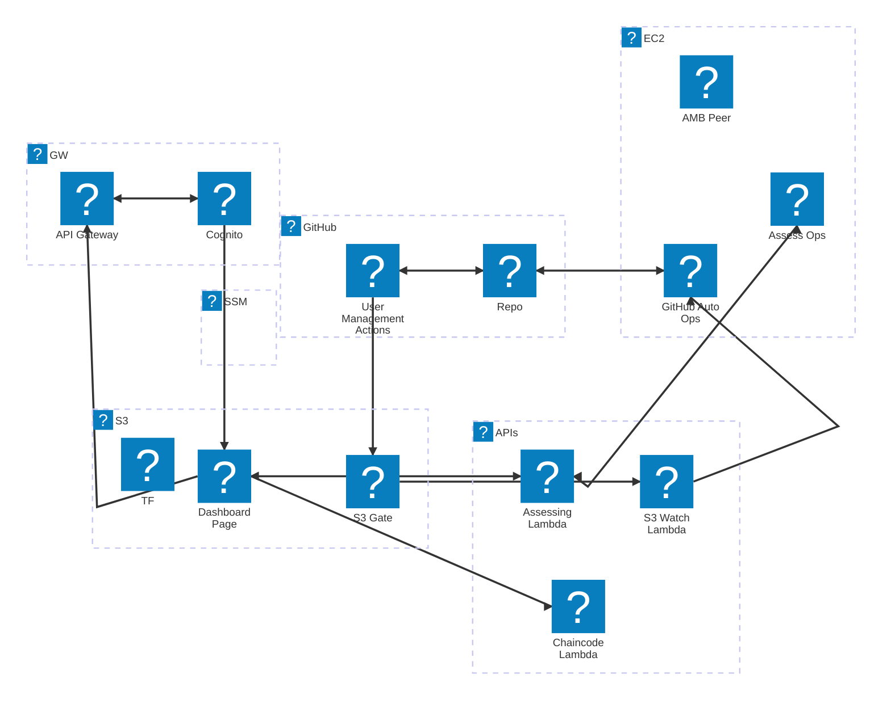

```mermaid

architecture-beta
    group api(logos:aws-lambda)[APIs]
    group ec2(logos:aws-ec2)[EC2]
    group ssm(logos:aws-systems-manager)[SSM]
    group s3(logos:aws-glacier)[S3]
    group gh(logos:github-octocat)[GitHub]
    group gw(logos:aws-api-gateway)[GW]


    service gwApi(logos:aws-api-gateway) [API Gateway] in gw
    service cognito(logos:aws-cognito) [Cognito] in gw

    service s3Gate(logos:aws-s3)[S3 Gate] in s3
    service tf(logos:aws-s3)[TF] in s3
    service page(logos:aws-s3)[Dashboard Page] in s3

    service gateWatch(logos:aws-lambda)[S3 Watch Lambda] in api
    service chainApi(logos:aws-lambda)[Chaincode Lambda] in api
    service assessEC2(logos:aws-lambda)[Assessing Lambda] in api

    service ghActions(logos:github-actions)[User Management Actions] in gh
    service ghRepo(logos:git-icon)[Repo] in gh

    service ec2AutoGH(logos:pyscript) [GitHub Auto Ops] in ec2
    service ec2Assess(logos:python) [Assess Ops] in ec2
    service ec2Peer(token:chain) [AMB Peer] in ec2


    gwApi:R <--> L:cognito
    cognito:B --> T:page
    page:L --> B:gwApi
    page:R <--> L:chainApi
    page:R <--> L:assessEC2
    assessEC2:R <--> B:ec2Assess 
    ghActions:B --> T:s3Gate
    s3Gate:R --> L:gateWatch
    gateWatch:R --> B:ec2AutoGH
    ec2AutoGH:L <--> R:ghRepo
    ghRepo:L <--> R:ghActions
```